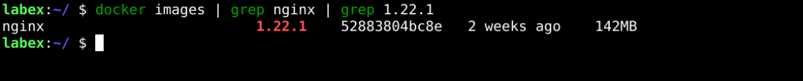
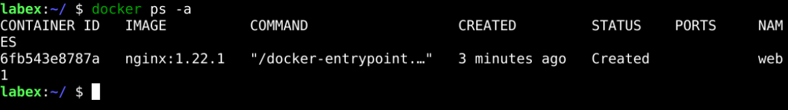
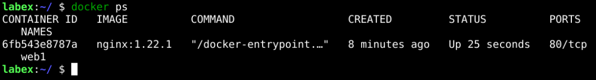
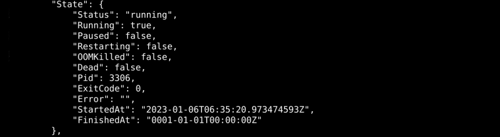
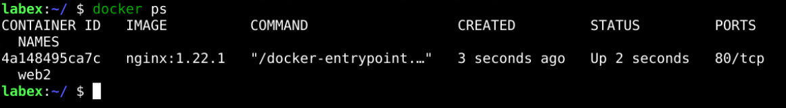

# Start Docker Container

## Introduction

This section will take you through two ways to start a container: to change the state of the container to run.

## Target

Your goal is to start the container using two different ways, the first is to create the container and then start it, and the second is to start the container directly using the `docker run` command.

## Result Example

Here's an example of what you should be able to accomplish by the end of this challenge:

1. Start by pulling the image `nginx:1.22.1` to the host.

   

2. Create a new container called `web1` using the `nginx:1.22.1` image.

   

3. Start the container and let its state become Running.

   

4. Use the `docker inspect web1` command to see specific status details.

   

5. Create a new container called `web2` using the `nginx:1.22.1` image with the `docker run` command.

   

## Requirements

To complete this lab, you will need:

- A working Docker installation.
- Know the commands of Docker.
