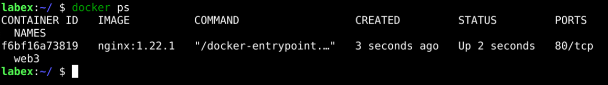
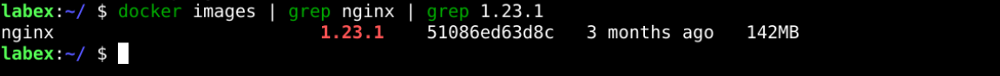
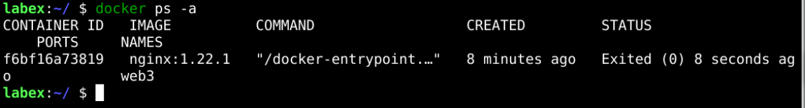
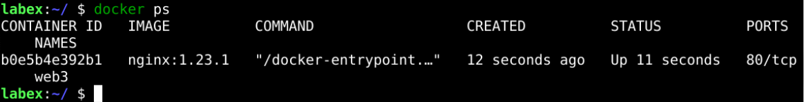

# Update Docker Container

## Introduction

Suppose you are running a service in a container, and a new version of the service is available through their docker image. In such a case, you would like to update the Docker container.

## Target

Your goal is to run a container and upgrade the image of that container.

## Result Example

Here's an example of what you should be able to accomplish by the end of this challenge:

1. Start a container called `web3` using the `nginx:1.22.1` image.

   

2. Pull the `nginx:1.23.1` image to the local host.

   

3. Stop the `web3` container.

   

4. Delete the `web3` container.

   

5. Start a container called `web3` with the `nginx:1.23.1` image.

   

## Requirements

To complete this lab, you will need:

- Ensure that `Docker` is installed and functioning.
- Have an available Docker image for updating the container.
