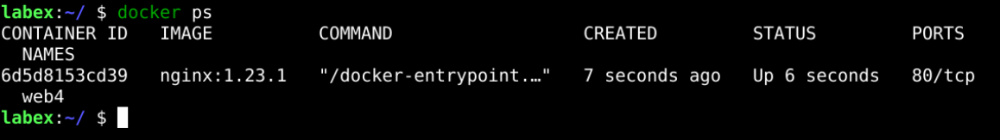
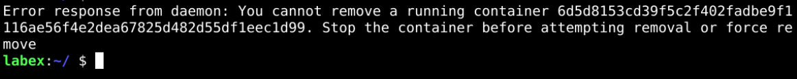
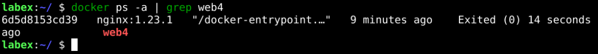

# Delete Docker Container

## Introduction

Removing or deleting the container means destroying all the processes running inside the container and then deleting the Container.

## Target

Your goal is to stop the running container and delete it.

## Result Example

Here's an example of what you should be able to accomplish by the end of this challenge:

1. Start a `web4` container using the `nginx:1.23.1` image.

   

2. Try to delete the running `web4` container. But the docker daemon throws an error. We can not delete a running docker container.

   

3. Stop the `web4` container.

   

4. Delete the `web4` container.

   

## Requirements

To complete this lab, you will need:

- Ensure that `Docker` is installed and functioning.
- A running container.
