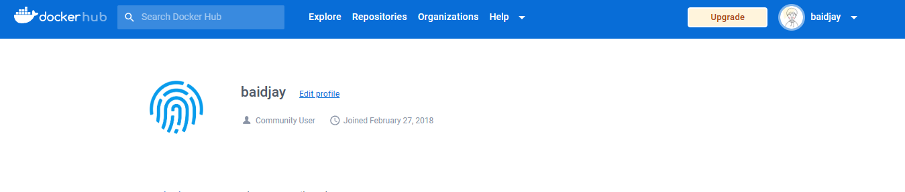
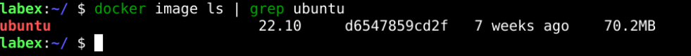
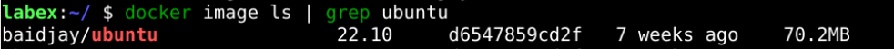
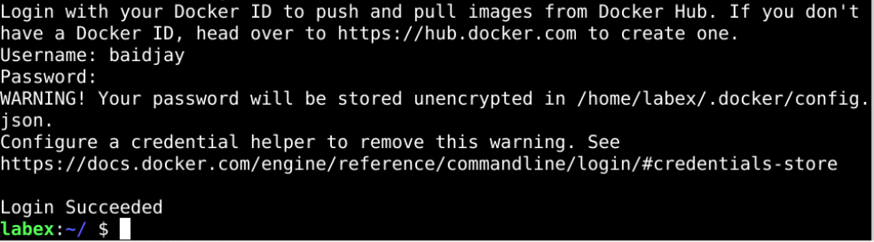
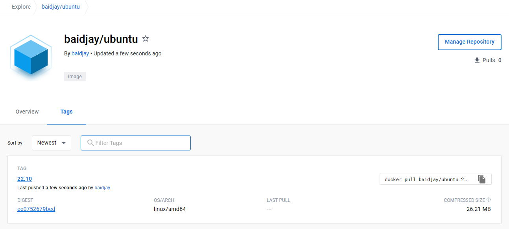

# Change Docker Image

## Introduction

A docker image contains an image name and an image tag, where the image name comprises the repository address and the image identifier. In this subsection, we will push a docker image created by someone else into our repository.

## Target

You aim to push the public `ubuntu` images on `dockerhub` to your private repository.

## Result Example

Here's an example of what you should be able to accomplish by the end of this challenge:

1. Register yourself on `dockerhub` and log in.

   

2. Download the `ubuntu:22.10` image from the docker hub to our local server.

   

3. Change the `ubuntu:22.10` image to our repository address.

   

4. Sign in to the docker hub.

   

5. Push the image to the remote repository.

   

## Requirements

To complete this challenge, you will need:

- Install the Docker engine.
- Have some knowledge of the Docker command line.
- A Docker image already exists that needs to be updated
