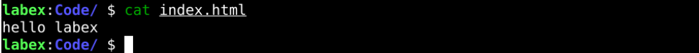
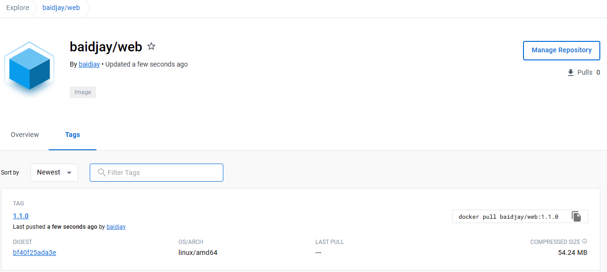
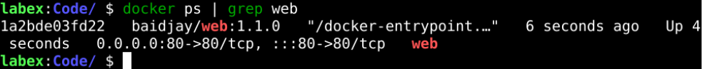
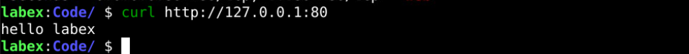

# Build A Web Image

## Introduction

We usually use the `nginx` to run static applications such as websites. In this section, we will build our web image.

## Target

Your goal is to create a Docker container image and package a simple web application into it, then use that image to start the container and make it accessible properly.

## Result Example

Here's an example of what you should be able to accomplish by the end of this challenge:

1. Create a new file called `index.html` in the `/home/labex/Code` directory with the content `hello labex`.

   

2. Create a new file called `Dockerfile` with the following contents

   

3. Build your web image with the format of `your_dockerhub_id/web:1.1.0`.

   

4. Push the created web image to the `dockerhub`.

   

5. start a container called `web` with `your_dockerhub_id/web:1.1.0`, and we also need to map port `80` to the host.

   

6. Use the `curl` command to visit `http://127.0.0.1` and check that the output is `hello labex`.

   

## Requirements

To complete this challenge, you will need:

- Building with `Dockerfile`
- Specify the base image as `Nginx:latest`
- Expose port `80` in the `Dockerfile` using the EXPOSE command
- After the build is complete, make sure the container can run properly and respond to HTTP requests
