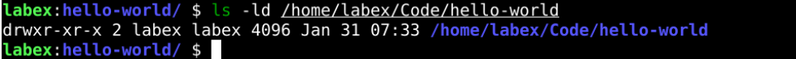
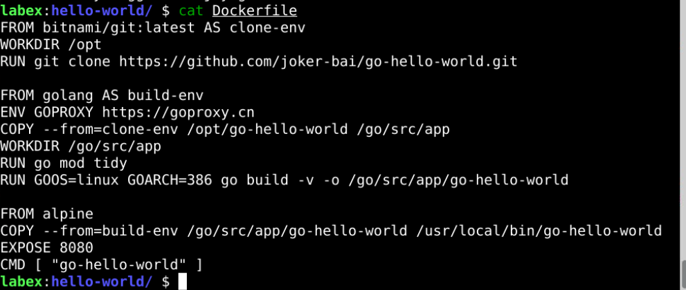
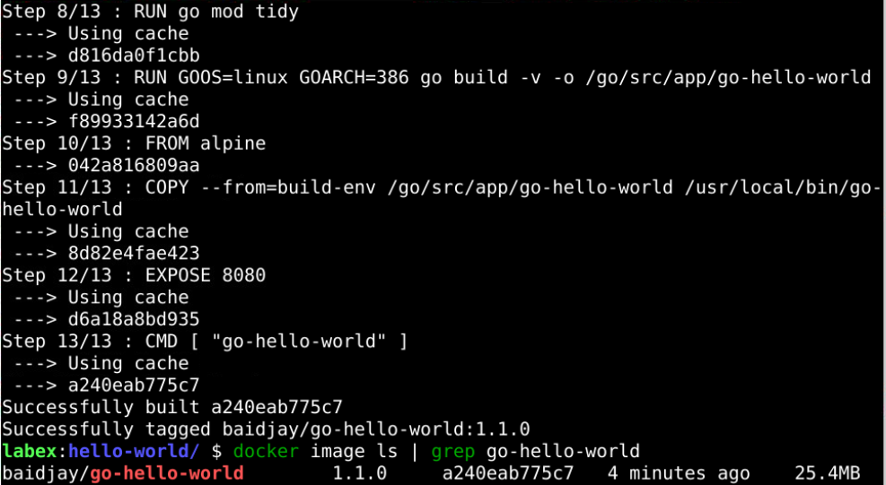
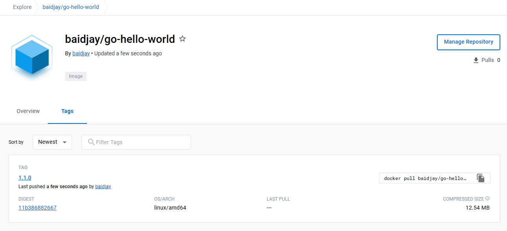
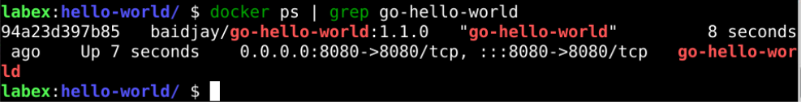
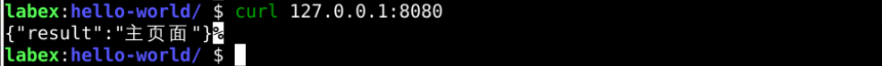

# Multi-stage Image Build

## Introduction

Creating a container image often involves two steps:

1. Compile the application build.
2. Create the application image.

This section will combine these two steps into one Docker file to achieve a multi-stage build.

To complete this challenge section, we have prepared a `Hello World` project at `https://github.com/joker-bai/go-hello-world.git`.

## Target

Your goal is to use a multi-stage build to make a container image and use that image to start a container and have it be accessible properly.

## Result Example

Here's an example of what you should be able to accomplish by the end of this challenge:

1. Create a `hello-world` directory in the `/home/labex/Code` directory.
   

2. Create a `Dockerfile` in this directory with the following contents
   

3. Build the docker image with the format of `your_dockerhub_id/go-hello-world:1.1.0`.
   

4. Push the image to the docker hub.
   

5. Start a container called `go-hello-world` and expose port `8080`.
   

6. Visit `http://127.0.0.1:8080` to check if it is OK.
   

## Requirements

To complete this challenge, you will need:

- Building with `Dockerfile`
- After the build is complete, make sure the container can run properly and respond to HTTP requests
