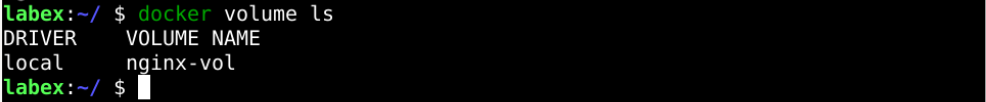
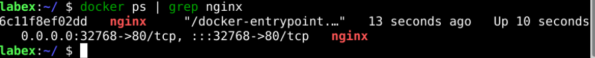
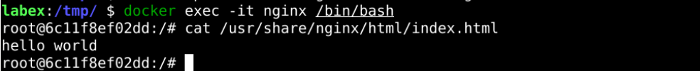

# Creating Containers With Data Volume

## Introduction

In this section, we will create containers using docker data volumes and then make copies of the files.

## Target

You aim to create a docker volume named `nginx-vol`, then start a container named `nginx` and mount it, and finally create an `index.html` file locally and copy it to the `nginx` container.

## Result Example

Here's an example of what you should be able to accomplish by the end of this challenge:

1. Create a data volume called `nginx-vol`.

   

2. create a container named `nginx` that will mount its `/usr/share/nginx/html` directory to the `nginx-vol` data volume.

   

3. Create a local `index.html` file with the content `hello world` in the`/tmp` directory.

   

4. Copy the local `index.html` file to the `nginx` container.

   

## Requirements

To complete this challenge, you will need:

- Know how to create a data volume using the `dokcer` command.
- Know how to start a container.
- Know how to copy local files to containers.
