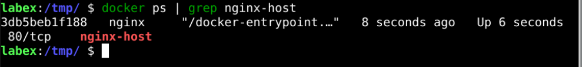
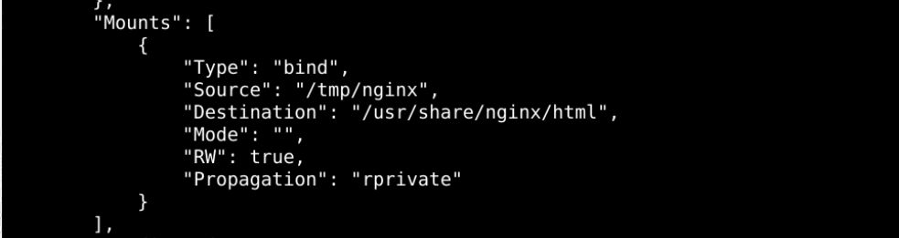
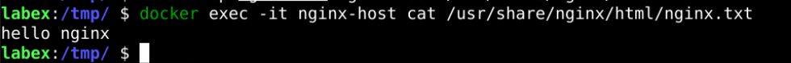

# Create Containers With Host Path

## Introduction

In many cases, we are not used to data volumes but instead. Use the native directory directly for data persistence. In this section, we will use the native directory to create containers.

## Target

Your goal is to create a container that uses `Host Path`, then copy the local files into the container and verify that the files in that container are the same as those in `Host Path`.

## Result Example

Here's an example of what you should be able to accomplish by the end of this challenge:

1. Create an `nginx` directory in the `/tmp` directory.

   

2. Start the `nginx-host` container that mounts the `/tmp/nginx` directory to the `/usr/share/nginx/html` directory in the container.

   

3. Check the specific mount details with the docker inspect command.

   

4. Create a local file called `nginx.txt` with the content `hello nginx`.

   

5. Copy the `nginx.txt` file to the `/usr/share/nginx/html` directory of the `nginx-host` container.

   

6. Check the `/tmp/nginx` directory on the local machine to see if there is a `nginx.txt` file.

   

## Requirements

To complete this challenge, you will need:

- Know the `Host Path` path you want to use.
- Know how to use some relevant commands inside the container to verify if the host directory or file can be accessed.
- Know how to start the container using Host Path.
- Be familiar with basic Linux commands, such as `cd`, `mkdir`, `touch`, etc.
