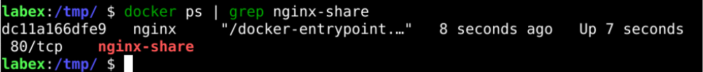
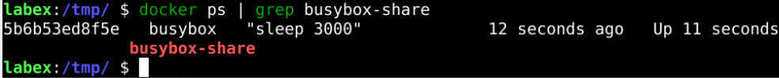
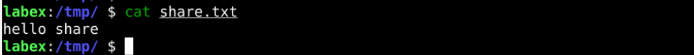
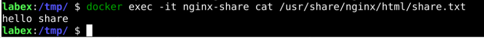
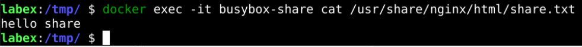

# Sharing Data Between Containers

## Introduction

In a containerized environment, sharing data from one container to another is sometimes necessary. In this case, various techniques can be used to achieve data sharing, and this challenge will explore how to share data between containers.

## Target

Your goal is to implement data sharing between two containers. Specifically, you will use `Host Path` to start container `A`, then start another container `B` and mount A's storage volume, eventually enabling data sharing between the two containers.

## Result Example

Here's an example of what you should be able to accomplish by the end of this challenge:

1. Create a `/tmp/share` directory on the local host.

   

2. Create a container named `nginx-share` and mount the local `/tmp/share` directory to the `/usr/share/nginx/html` directory in the container.

   

3. Create a container named `busybox-share` and mount it from `nginx-share` container.

   

4. Create a local file named `share.txt` with the content `hello share`.

   

5. Copy the `share.txt` file to the `nginx-share` container.

   

6. Go to the `busybox-share` container to see if the share.txt file exists.

   

## Requirements

To complete this challenge, you will need:

- Be familiar with the basic operations and concepts of Docker containers.
- Use Docker command line tools to create, run, and stop containers.
- Understand the concept and usage of data volumes.
- Understand how to mount a data volume in a container.
- Be familiar with basic Linux commands, such as `cd`, `mkdir`, `touch`, etc.
