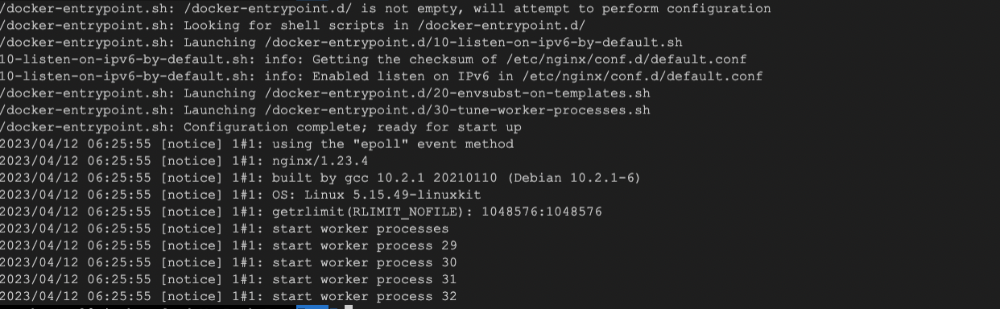

# Starting a Container

In this step, we will start a container and access its logs.

1. Run the following command to start a new container:

```
docker run -d --name my-container nginx
```

This command starts a new container based on the `nginx` image and gives it a name of `my-container`.

2. Run the following command to access the logs of the container:

```
docker logs my-container
```

This command prints the logs of the container to the terminal.

