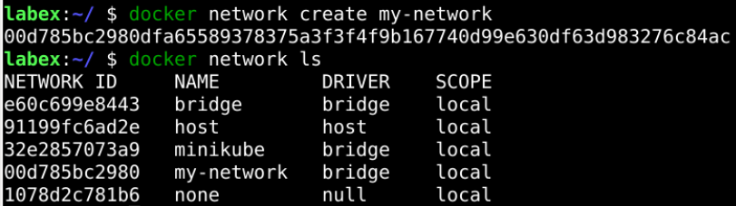

# Create A Network

To create a network, we use the `docker network create` command. Let us create a bridge network named `my-network`:

```sh
docker network create my-network
```

We can verify that the network was created by running:

```sh
docker network ls
```

This will list all the available networks on your machine. You should see `my-network` listed.

