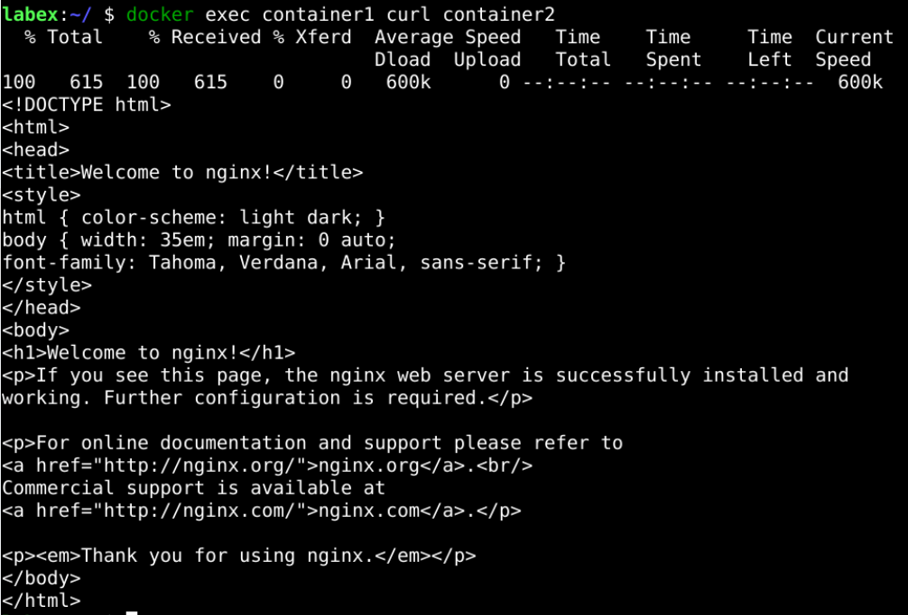

# Test Connectivity

We can now test connectivity between the containers. Let us execute a command in `container1` that will access `container2`:

```sh
docker exec container1 curl container2
```

This should return the HTML content of the nginx web server running in `container2`.

