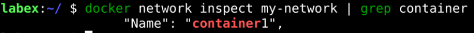

# Disconnect A Container From A Network

We can disconnect a container from a network using the `docker network disconnect` command. Let us disconnect `container2` from `my-network`:

```sh
docker network disconnect my-network container2
```

We can verify that `container2` is no longer connected to `my-network` by running:

```sh
docker network inspect my-network
```

This will show the list of containers connected to `my-network`. You should not see `container2` listed.

