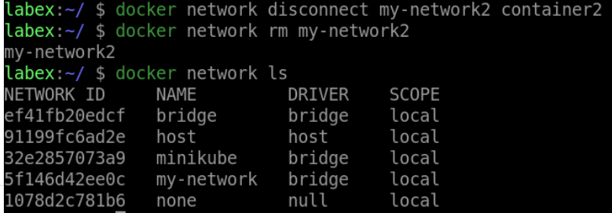

# Remove A Network

We can remove a network using the `docker network rm` command. Let us remove "my-network2":

```sh
docker network disconnect my-network2 container2
docker network rm my-network2
```

We can verify that "my-network2" was removed by running:

```sh
docker network ls
```

This will list all the available networks on your machine. You should not see "my-network2" listed.

