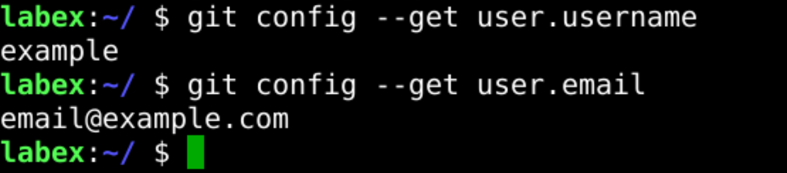

# Git Configuration

If you want to use git with your GitHub account, you need to configure git to work with your GitHub account.

To configure git, you need to provide your GitHub username and email address.

## Example

## Requirements

- Configure git with your GitHub username and email address.
- Use global config file.
