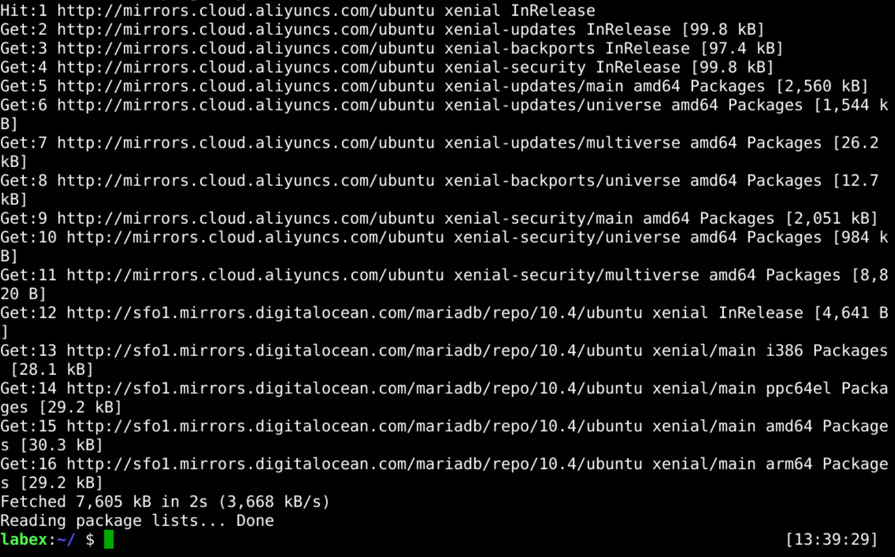
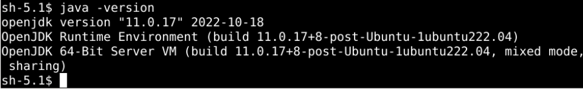
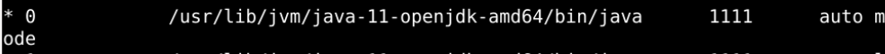
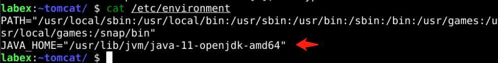

# Install JDK

## Introduction

Jenkins is developed in Java, so its runtime environment requires JDK.

There are various ways to install JDK, such as binary installation, source package installation, etc. Since our challenge environment is Ubuntu, which has java repositories, it is easiest to install directly using the apt command.

## Target

Your goal is to follow `JDK11` and configure the `JAVA_HOME` environment variable on Ubuntu OS.

## Result Example

Here's an example of what you should be able to accomplish by the end of this challenge:

1. Update the Ubuntu package list.
   

2. Install the OpenJDK 11.
   

3. Find out where apt installed `Java` on Ubuntu.
   

4. With the location of the Java installs on the clipboard, open up the server’s environment file with vim.
   

5. Force the Ubuntu terminal to reload the environment configuration file.

   ```bash
   source /etc/environment
   ```

6. Be able to echo the `JAVA_HOME` environment variable in an Ubuntu terminal window.
   

## Requirements

To complete this lab, you will need:

- Ubuntu operating system installed.
- A user account with administrator privileges.
- Access to the Internet.
