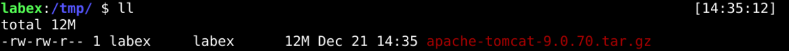
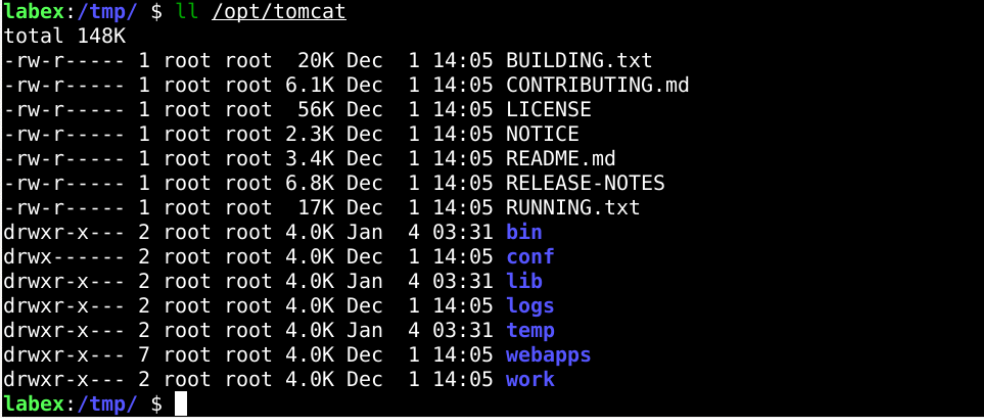
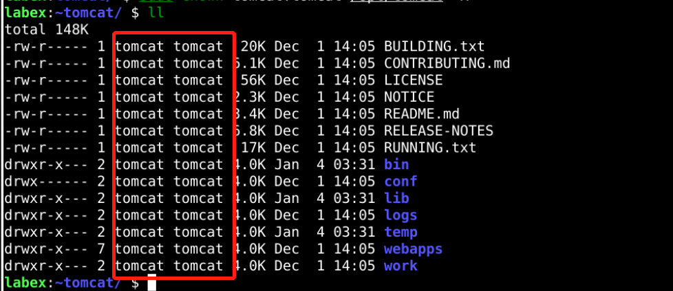

# Install Tomcat

## Introduction

Tomcat, often called Apache Tomcat, is one of the most popular applications designed to execute a Java servlet and render web servers with Java page coding.

## Target

Your goal is to install Tomcat in Ubuntu as a binary package.

## Result Example

Here's an example of what you should be able to accomplish by the end of this challenge:

1. Create a new tomcat group that will run the service.
   

2. Create user members of the Tomcat group with a home directory `/opt/tomcat` for running the Tomcat service.
   

3. Download the tomcat Binary Distributions from the copied link (from the Tomcat website `https://tomcat.apache.org/download-90.cgi`).
   

4. Extract the binary tomcat package to the `/opt/tomcat` directory.
   

5. Give the Tomcat group ownership over the entire installation directory with the `chown` command
   

## Requirements

To complete this lab, you will need:

- Ubuntu operating system installed.
- A user account with administrator privileges.
- Access to the Internet.
