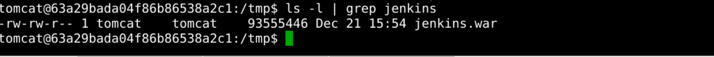
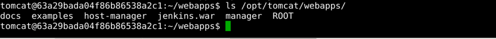
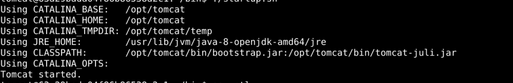

# Install Jenkins

## Introduction

If you have arrived at this step, you have Java and Tomcat installed on your operating system, and in this step, we will install Jenkins.

> Tips: We need to do this under the tomcat user.

## Target

Your goal is to build on step 2 and deploy Jenkins using tomcat.

## Result Example

Here's an example of what you should be able to accomplish by the end of this challenge:

1. Use the `sudo` command to enter the tomcat user.

   ```bash
   sudo su tomcat
   ```

2. Download the latest Jenkins WAR file to an appropriate directory on your machine(<https://www.jenkins.io/download/>). Go to the `/tmp` directory and download the latest version of the Jenkins WAR file.
   

3. Copy the downloaded Jenkins war file to the Tomcat Web directory.
   

4. Start the Tomcat service, which will automatically unpack the Jenkins war file.
   

5. Tomcat's default WEB port is `8080`, and we can use `http://127.0.0.1:8080/jenkins` to access the Jenkins service.

## Requirements

To complete this lab, you will need:

- Ubuntu operating system installed.
- A user account with administrator privileges.
- Access to the Internet.
