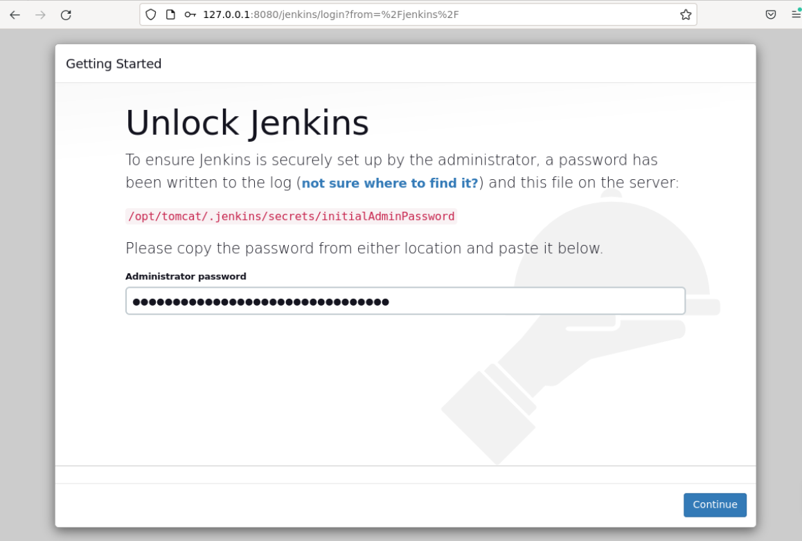
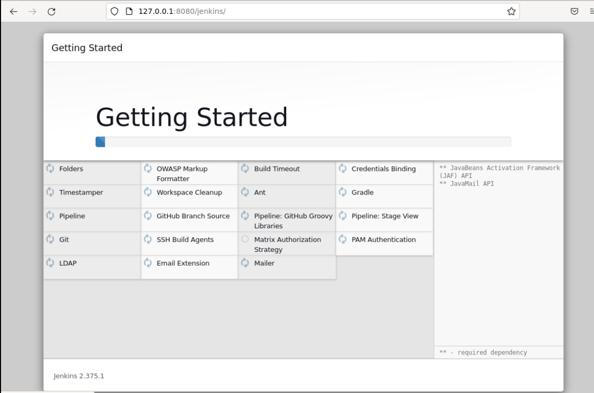
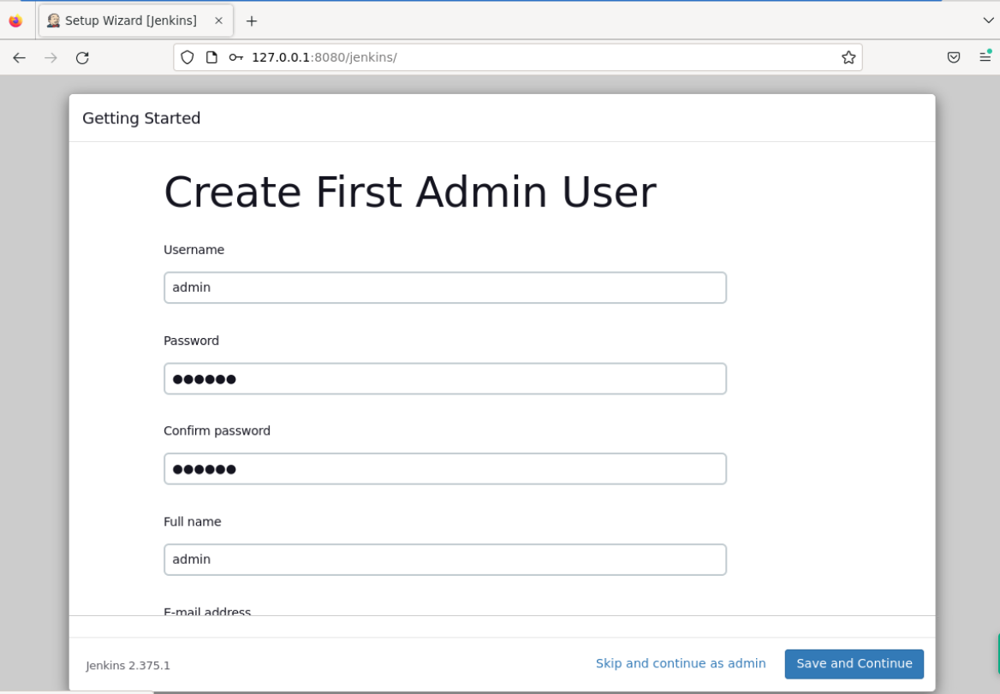
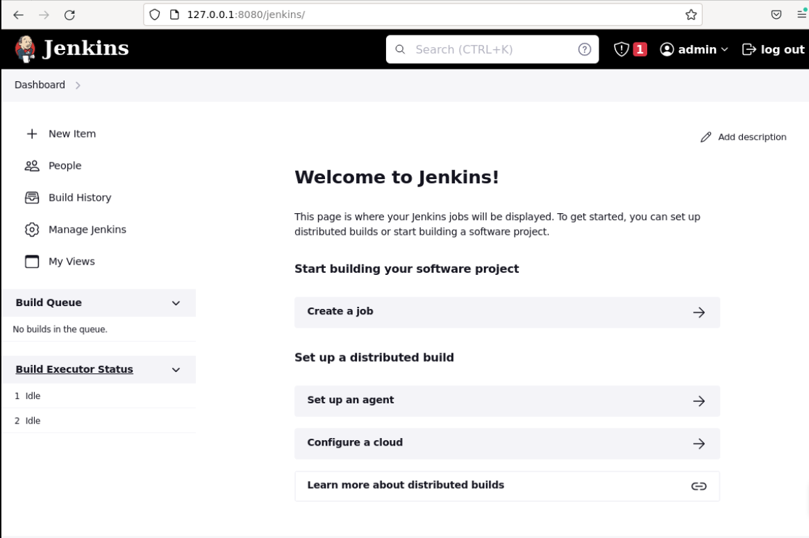

# Initialize Jenkins

## Introduction

If it's the first time you deploy a Jenkins service, it needs to be initialized to work correctly, and we'll do that in this section.

## Target

Your goal is to initialize Jenkins and successfully enter the Jenkins home page.

## Result Example

Here's an example of what you should be able to accomplish by the end of this challenge:

1. Get the administrator password from the information in the chart and unlock the Jenkins server.
   

2. Install the suggested plugin option immediately after beginning the installation process.
   

3. Create the `admin` user with the password `123456`.
   

4. Go to the Jenkins Home page.
   

## Requirements

To complete this lab, you will need:

- Ubuntu operating system installed.
- A user account with administrator privileges.
- Access to the Internet.
