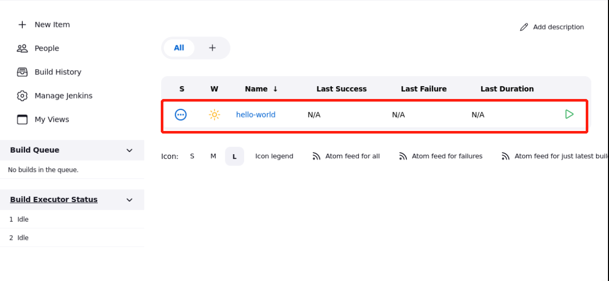
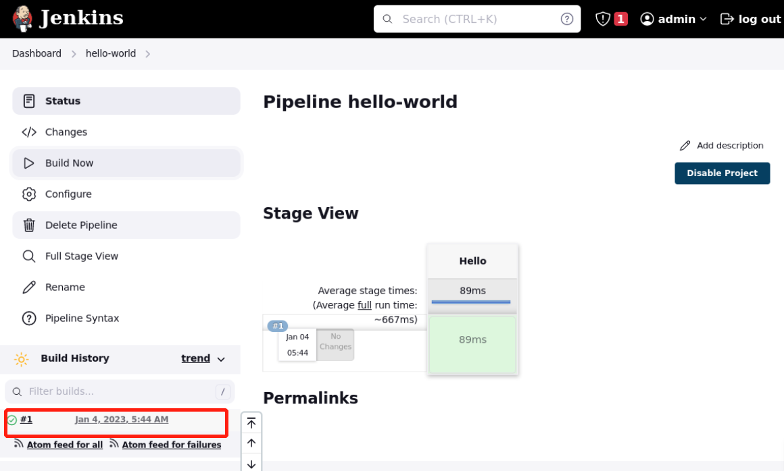
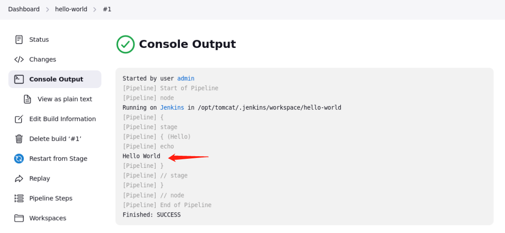

# Manage Pipeline Project

## Introduction

Once we have Jenkins installed, we will create our first pipeline project.

## Target

Your goal is to create a Pipeline in an already installed Jenkins and run it.

## Result Example

Here's an example of what you should be able to accomplish by the end of this challenge:

1. Create a pipeline, the pipeline name is `hello-world`, and we will print `Hello World`.
   

2. Click `Build Now` to run the pipeline.
   

3. Select a specific Task ID to check the build output.
   

## Requirements

To complete this lab, you will need:

- An available Jenkins service.
- The Pipeline plugin is installed.
