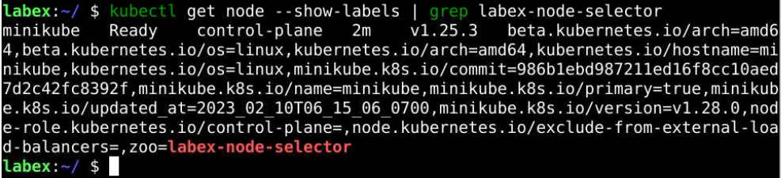
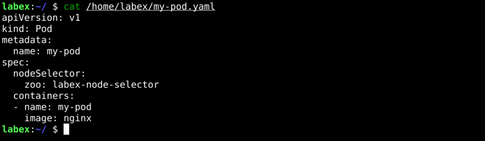
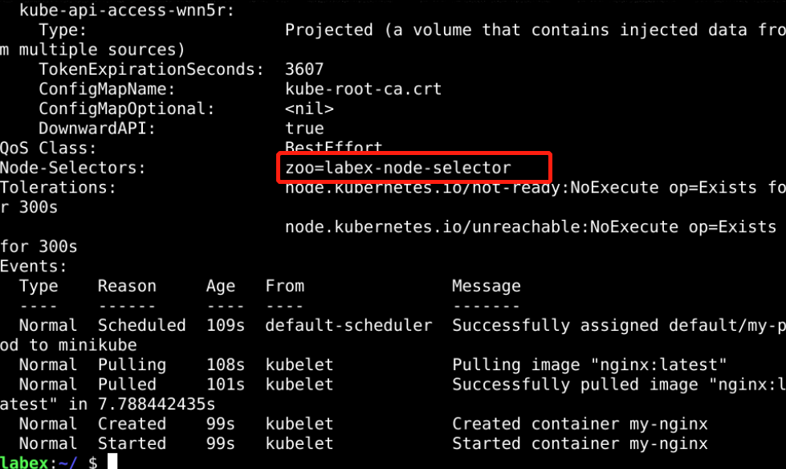

# Node Selector

## Introduction

In a large Kubernetes cluster, there are typically many types of nodes, such as nodes with SSD disks, GPU nodes, and so on. Different applications have different node requirements, such as scheduling IO-intensive applications on nodes with SSD disks when the default random scheduling method cannot be used.

Here is a sample challenge for deploying a Pod with a node selector in Kubernetes. It will help you understand how to deploy a Pod to a specific node in a Kubernetes cluster based on a node selector label.

## Target

Your goal is to create a Pod and schedule it to a node with the label `zoo=labex-node-selector`.

## Result Example

Here's an example of what you should be able to accomplish by the end of this challenge:

1. Add labels `zoo=labex-node-selector` to the nodes, which can then be used as a selector for scheduling Pods or other purposes in your cluster.

   

2. Create a YAML file called `my-pod.yaml` in `/home/labex` directory for the Pod specification, including the node selector label.

   

3. Deploy the Pod YAML file created above to the cluster.

   

4. Verify that the Pod has been deployed to the node with the "zoo=labex-node-selector" label.

   

## Requirements

To complete this challenge, you will need:

- A Kubernetes cluster has been installed and configured as required.
- You have a basic knowledge of Kubernetes and YAML orchestration.
- You understand the concepts and usage of Node Selector.
