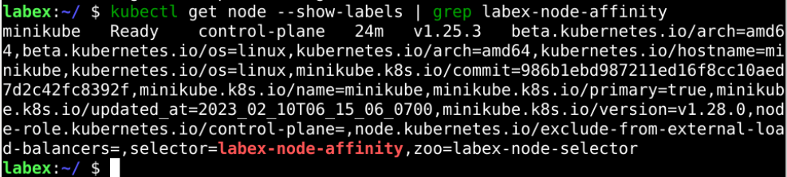
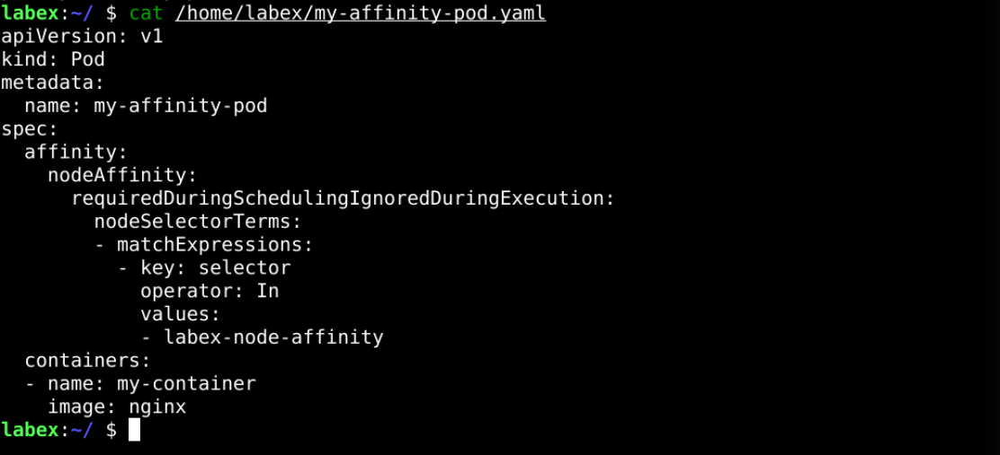
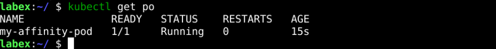

# Node Affinity

## Introduction

Compared to Node Selector, Node Affinity supports more complex scheduling rules. In this section, we will use Node Affinity to schedule Pods.

## Target

Your goal is to create a Pod of `Node Affinity` and schedule it to the node with the label `selector=labex-node-affinity`.

## Result Example

Here's an example of what you should be able to accomplish by the end of this challenge:

1. Add the label `selector=labex-node-affinity` to the nodes, which we can use for scheduling with the node affinity.

   

2. Create a YAML file called `my-affinity-pod.yaml` in the `/home/labex` directory with node affinity. You'll need to specify the desired node affinity rules in the `spec.template.spec.affinity` section of the YAML file.

   

3. Deploy the YAML file to the cluster. Check if Node Affinity is used and if the Pod is successfully dispatched to a specific node.
   

## Requirements

To complete this challenge, you will need:

- A Kubernetes cluster has been installed and configured as required.
- You have a basic knowledge of Kubernetes and YAML orchestration.
- You understand the concepts and usage of Node Affinity.
