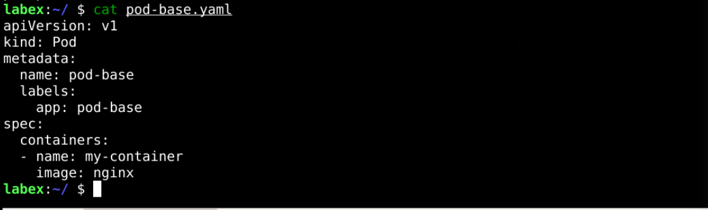
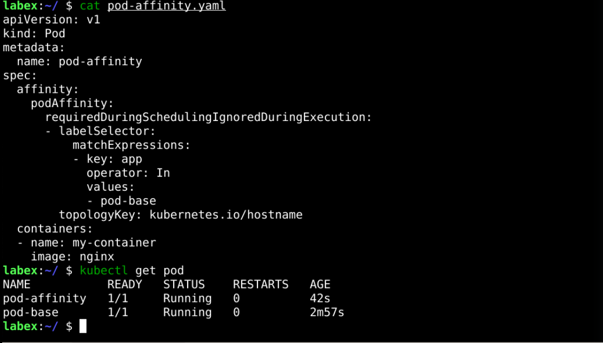
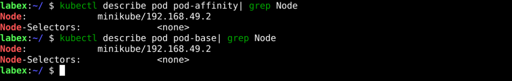
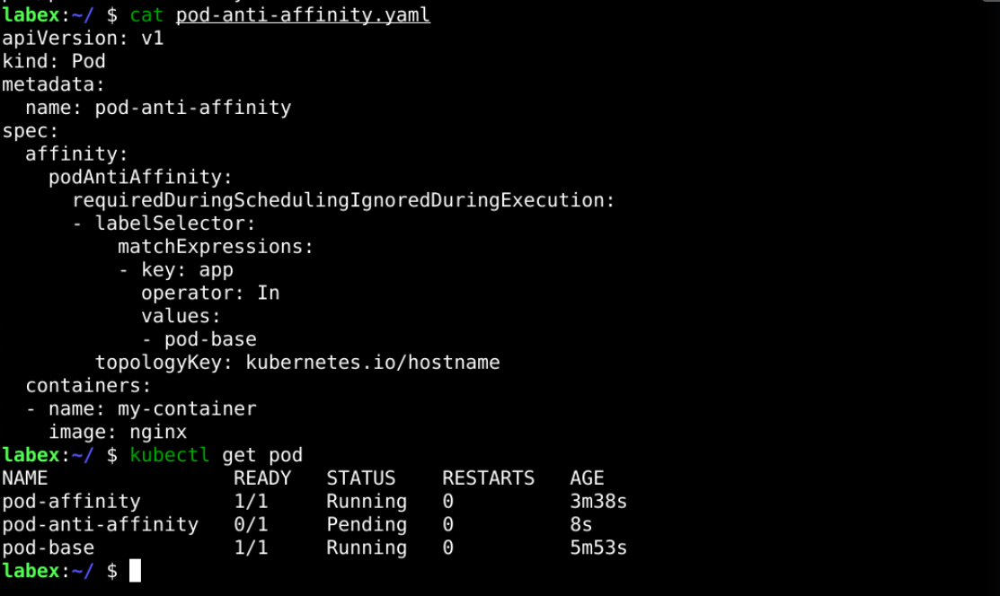
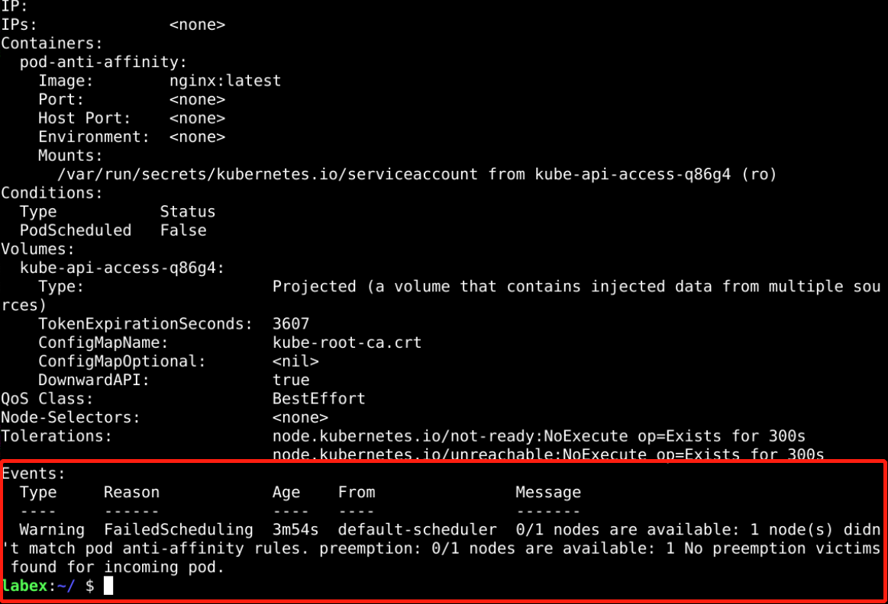

# Pod Affinity Or Pod Anti-Affinity

## Introduction

Pod Affinity and Pod Anti-Affinity are essential features in Kubernetes that specify affinity or anti-affinity relationships between Pods. Using Pod Affinity or Pod Anti-Affinity, you can schedule Pods on nodes adjacent to other Pods or prevent multiple similar Pods from being scheduled on the same node.

A Pod Affinity or Pod Anti-Affinity challenge is provided here to help users deepen their understanding and skills in using them.

## Target

Your goal is to create three Pods, one as the base Pod and two others based on the base Pod for Pod Affinity and Pod Anti-Affinity, while making sure their scheduling matches affinity and non-affinity.

## Result Example

Here's an example of what you should be able to accomplish by the end of this challenge:

1. Deploy a pod called `pod-base` in Kubernetes using a YAML file that defines the pod specifications, including the label `app=pod-base` that you mentioned.

   

2. Deploy a Pod called `pod-affinity` and use Pod Affinity to send this Pod to the node that has the Pod labeled `app=pod-base`.

   

3. Check that `pod-affinity` is sent to the node where `pod-base` is located.

   

4. Sometimes we don't want to schedule several different types of Pods on the same node. We now create a `pod-anti-affinity` pod, which does not allow the pod to be scheduled on the node containing the `app=pod-base` pod.

   

5. As we only have one node in our cluster, we see that `pod-anti-affinity` is pending. The specific events are as follows.

   

## Requirements

To complete this challenge, you will need:

- A Kubernetes cluster has been installed and configured as required.
- You have a basic knowledge of Kubernetes and YAML orchestration.
- You understand the concepts and usage of Pod Affinity and Pod Anti-Affinity.
