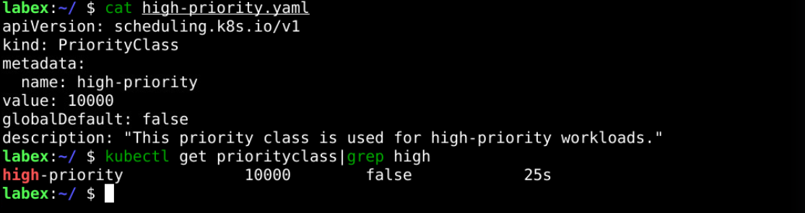
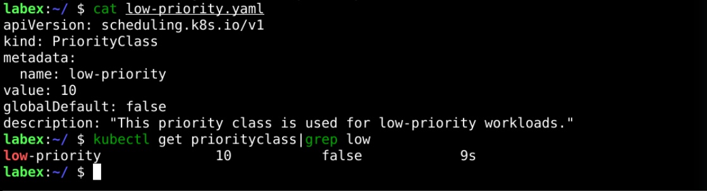
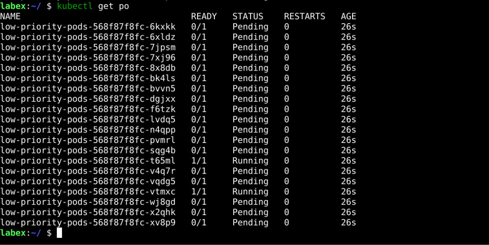
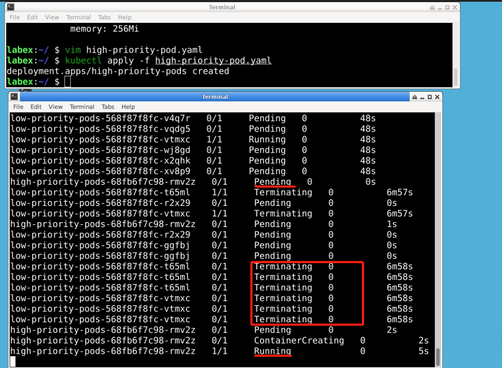

# Priority Scheduler

## Introduction

In Kubernetes, the priority scheduler is a feature that allows you to assign priority scores to pods, and the scheduler will take these priorities into account when making scheduling decisions. This can be useful in cases where you have a mix of pods with different resource requirements and you want to ensure that pods with higher priority get scheduled first or if you want to give preference to pods running critical services.

## Target

Your goal is to create Pods of different priorities in Kubernetes and achieve the ability to schedule high-priority Pods even when the cluster is complete.

## Result Example

Here's an example of what you should be able to accomplish by the end of this challenge:

1. Create a `high-priority` policy called `high-priority`, with a priority of `10000`.

   

2. Create a `low-priority` policy called `low-priority` with a priority of `10`.

   

3. Deploy many pods that altogether request a lot of CPU. The deployment is called `low-priority-pods, which have the following specific requirements.

   - The number of replicas is 20.
   - CPU and memory resource requirements are 500m and 256Mi.
   - Use the low-priority policy.

   

4. Deploy a deployment called high-priority-pods, which has the following specific requirements.

   - The number of replicas is 1.
   - CPU and memory resource requirements are 1000m and 256Mi.
   - Use the high-priority policy.

   

   > Tips: Open two terminals and use `kubectl get pod -w` to monitor changes to the pod in real time.

If you check both deployments, you will notice that Kubernetes has killed some of the pods with low priority to be able to schedule pods with higher priority!

## Requirements

To complete this challenge, you will need:

- A Kubernetes cluster has been installed and configured as required.
- You have basic knowledge of Kubernetes and YAML orchestration.
- You understand the concept and use of the Priority Scheduler
