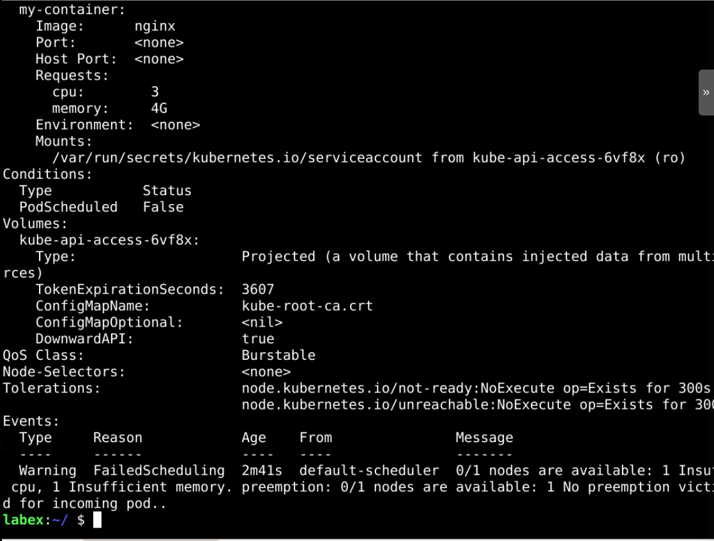

# ​Resource Scheduler

## Introduction

When deploying pods in your cluster, you can guide Kubernetes on your workload's required resources (CPU / memory). These requests will be taken care of in the scheduling algorithm.

## Target

Your goal is to create two Pods with different resource requirements (CPU and memory) and schedule them to the node that can meet their needs.

## Result Example

Here's an example of what you should be able to accomplish by the end of this challenge:

1. Deploy a low-demand pod in the cluster and observe if the pod can be scheduled and started correctly. The specific configuration of the pod is as follows.

   - CPU: 10m.
   - Memory: 100Mi.
   - The name of the Pod is `low-request-pod`.

   

2. Deploy a high-demand Pod with the following requirements.

   - CPU: 3.
   - Memory: 4G.
   - Pod's name is `high-request-pod`.

   

3. Based on the Pod's event, we know that no node in the cluster can satisfy the Pod at the moment, so the Pod cannot be scheduled and run.

   

Therefore, when we configure requests to Pods, we need to integrate the overall cluster resource situation and application-specific usage to configure.

## Requirements

To complete this challenge, you will need:

- A Kubernetes cluster has been installed and configured as required.
- You have a basic knowledge of Kubernetes and YAML orchestration.
- You understand the concepts and usage of the Resource Scheduler.
