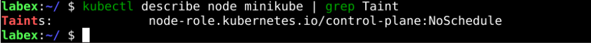
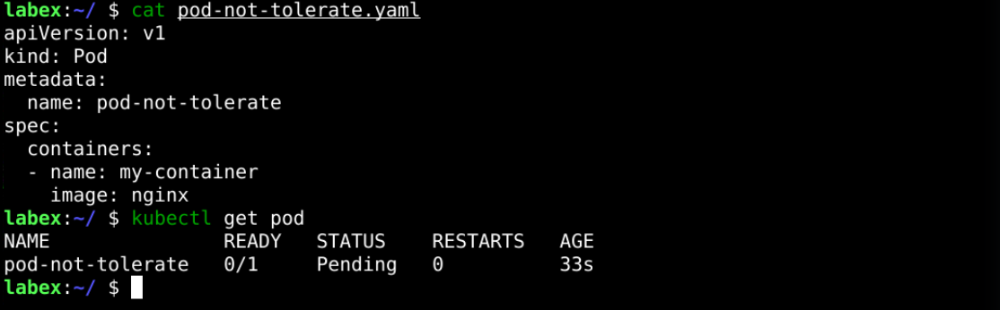
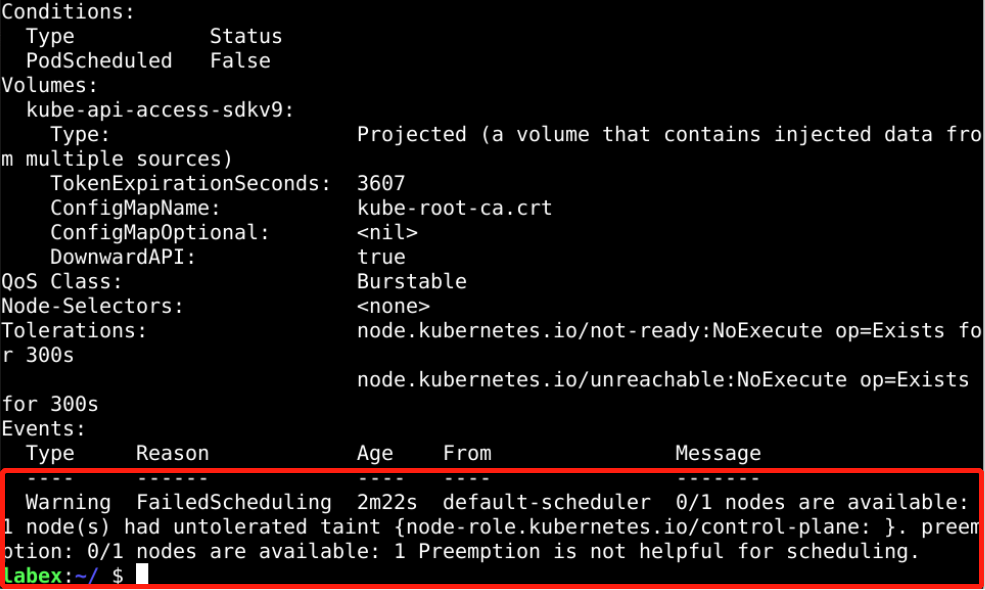
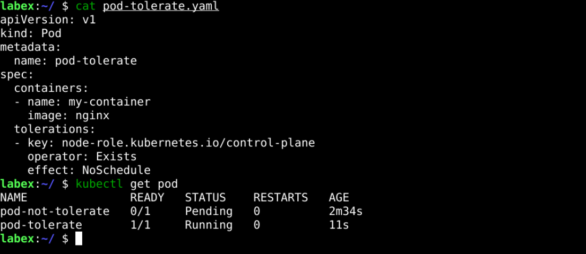
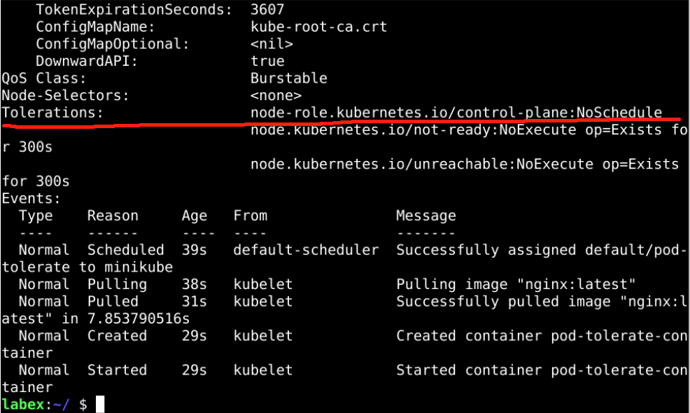

# ​Taint Scheduler

## Introduction

In Kubernetes scheduling, there is also advanced scheduling called taint scheduling, which is used as long as only pods that tolerate that taint are scheduled.

## Target

Your goal is to create two Pods, one that tolerates taint on nodes and one that does not, and then verify that the Pods are scheduled as expected.

## Result Example

Here's an example of what you should be able to accomplish by the end of this challenge:

1. We need to taint the node. As we only have one node in our cluster, we set its taint to non-schedulable.

   

2. Deploy a `pod-not-tolerate` pod that does not tolerate corrupted nodes and monitors the scheduling of Pods.

   

3. Check the status of the `pod-not-tolerate` Pod. And the Pod is not scheduled to the Node.

   

4. Deploy a `pod-tolerate` that tolerates this node's taint and monitors its scheduling.

   

5. check the status of the `pod-tolerate` Pod. And the Pod is scheduled to the Node.

   

## Requirements

To complete this challenge, you will need:

- A Kubernetes cluster has been installed and configured as required.
- You have a basic knowledge of Kubernetes and YAML orchestration.
- You understand the concepts and usage of Taint and Tolerations.
