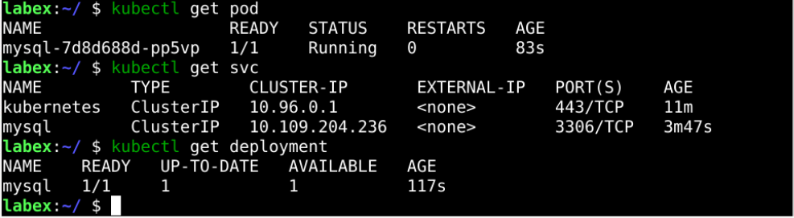
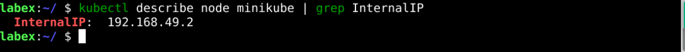
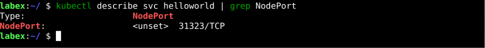
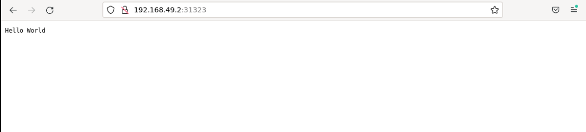

# Deploy a Multi-Tier Application

## Introduction

In this subsection, we will deploy a multi-tier application that mainly includes the backend and databases.

## Target

Your goal is to deploy `MySQL` and `HelloWorld` services in Kubernetes and ensure that the services are deployed and made accessible properly. No specific YAML manifest is provided for this objective; you must implement it yourself.

## Result Example

Here's an example of what you should be able to accomplish by the end of this challenge:

1. Deploy MySQL to a Kubernetes cluster with the following requirements.

   - The password for root is `root`.
   - Create a database named `hello-world`.
   - Create a service called `mysql`.
   - MySQL version is 5.7.

     

2. Deploy the Hello World application with specific requirements.

   - Use the `labex/go-hello-world:v2.0` image.
   - The application port is `8080`.
   - Expose the service using `NodePort`, and the port is `31323`.
   - Add the following environment variables and values.

     - MYSQL_USER: `root`.
     - MYSQL_PASSWORD: `root`.
     - MYSQL_ADDRESS: `mysql`.
     - MYSQL_DBNAME: `hello-world`.
     - CONTENT: `Hello World`.

   - The names of both service and deployment are `helloworld`

     

3. Use `http://<host_ip>:<nodeport>` to access the page and see if the output is `Hello World`.

   - Get the IP address of the node.

     

   - Get the service nodePort of `helloworld`.

     

   - The results are obtained in the browser access.

     

## Requirements

To complete this challenge, you will need:

- Familiarity with the basics of Docker and Kubernetes.
- Installed and configured a Kubernetes cluster.
- Experience writing YAML files to define Kubernetes objects.
