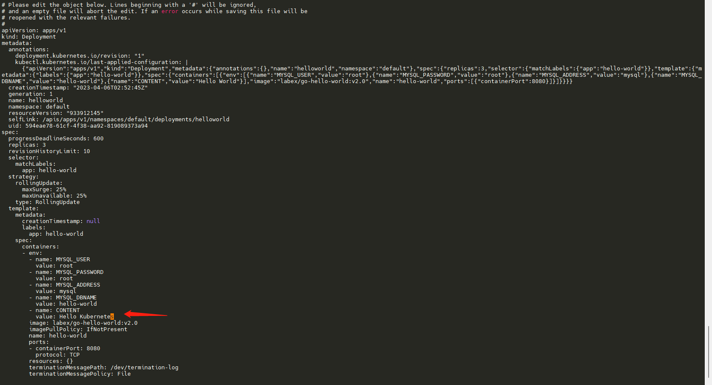
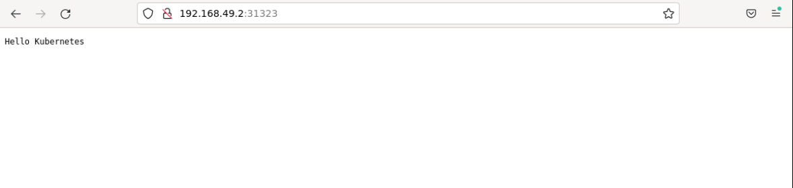

# Update the Application

## Introduction

The application will not be updated iteratively, but the new iterations will eventually be pushed into the production system for users to use. In this section, we will update the application by manually updating it.

## Target

Your goal is to update the `helloworld` application so that its content changes from `Hello World` to `Hello Kuberenetes`.

## Result Example

Here's an example of what you should be able to accomplish by the end of this challenge:

1. Change the `CONTENT` environment variable of `helloworld` deployment in the cluster to "Hello Kubernetes" and wait for the Pod to redeploy successfully.

   

2. Go through the pages to see if the content has been modified correctly.

   

## Requirements

To complete this challenge, you will need:

- Familiarity with the basics of Docker and Kubernetes.
- Skills in basic operations using Kubernetes command line tools (`kubectl`) and YAML files.
