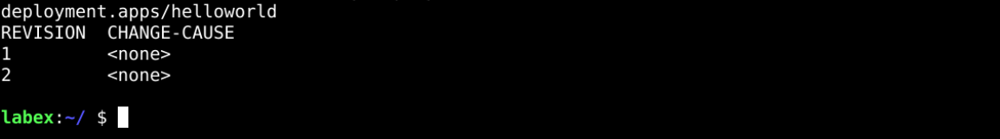
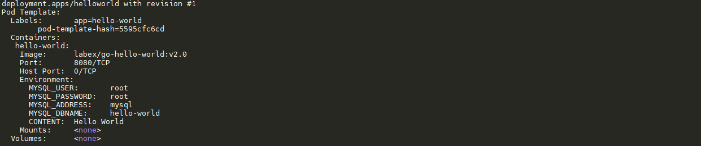
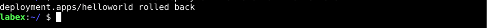
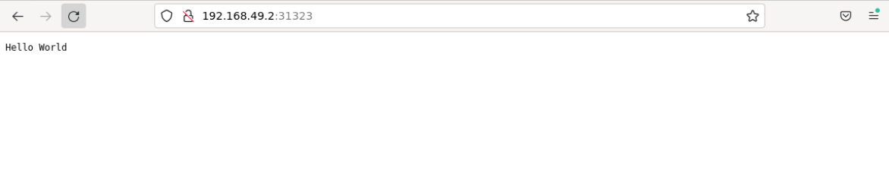

# Roll Back the Update

## Introduction

Not every iteration of the application update is booming, and sometimes we encounter unusual failures that require us to roll back the application to the previous stable version.

## Target

Your goal is to version back the `helloworld` application to a version where the content is `Hello World`.

## Result Example

Here's an example of what you should be able to accomplish by the end of this challenge:

1. Check the history of `helloworld` application.

   

2. There are two versions of the `helloword` application; check the first version for more information.

   

3. Select version `1` we want to roll back.

   

4. Calibrate the fallback to be successful. If the result returned is `Hello World`, the fallback is successful.

   

## Requirements

To complete this challenge, you will need:

- Familiarity with the basics of Docker and Kubernetes.
- Skills in basic operations using Kubernetes command line tools (`kubectl`) and YAML files.
