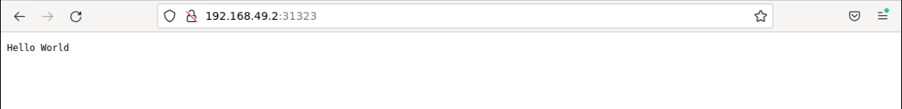

# Scale the Application Deployment

## Introduction

If the number of user visits suddenly increases and the existing application cannot carry user requests, it is time to do horizontal scaling of the application.

## Target

Your goal is to expand the replicas of the `helloworld`.

## Result Example

Here's an example of what you should be able to accomplish by the end of this challenge:

1. Extend the number of replicas of the application to 5.

   

2. Check if the status of all replicas is Running.

   

3. Whether the application can be accessed correctly from the web page.

   

## Requirements

To complete this challenge, you will need:

- Familiarity with the basics of Docker and Kubernetes.
- Skills in basic operations using Kubernetes command line tools (`kubectl`) and YAML files.
