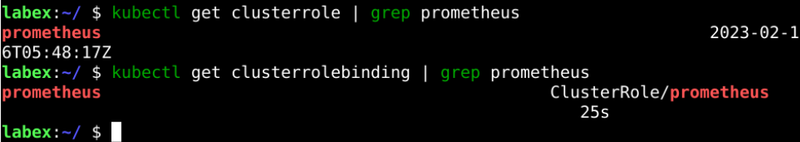

# Create Namespace And ClusterRole

## Introduction

In Kubernetes, to isolate different types of applications, it is usually the case that they are deployed under different Namespaces. For Prometheus, it is through Kubernetes APIs to get Node, Pods, Deployments, and other metrics, so it needs to create ClusterRole to authorize it.

## Target

Your goal is to create the Namespace and ClusterRole required by Prometheus as required, in preparation for installing Prometheus later.

## Result Example

Here's an example of what you should be able to accomplish by the end of this challenge:

1. Create a Kubernetes namespace for all our monitoring components.

   

2. Create a `cluster-role.yaml` in the `/home/labex` directory and copy the file contents from this link –>[Prometheus ClusterRole File](https://raw.githubusercontent.com/joker-bai/kube-prometheus/main/cluter-role.yaml). Then deploy the YAML file to the cluster.

   

## Requirements

To complete this challenge, you will need:

- A Kubernetes cluster has been installed and configured as required.
- You have a basic knowledge of Kubernetes and YAML orchestration.
- You understand the concepts and usage of Namespace and ClusterRole and have enabled RBAC (Role-Based Access Control) in the cluster.
