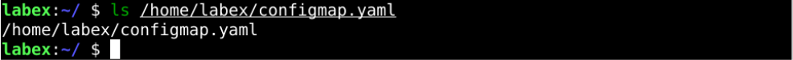
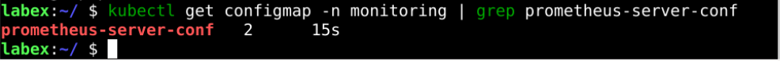

# Create Prometheus ConfigMap

## Introduction

All configurations for Prometheus are part of the `prometheus.yaml` file and all the alert rules for the Alertmanager are configured in `prometheus.rules`.

Externalizing Prometheus configurations to a Kubernetes Config Map means you don't need to build the Prometheus image whenever you want to add or remove a configuration. You need to update the config map and restart the Prometheus pods to apply the new configuration.

## Target

Your goal is to create a ConfigMap and store Prometheus configuration information in this ConfigMap so that it can be read when Prometheus is deployed.

## Result Example

Here's an example of what you should be able to accomplish by the end of this challenge:

1. Create a `configmap.yaml` in the `/home/labex` directory and copy the contents to the [Prometheus Config File](https://raw.githubusercontent.com/joker-bai/kube-prometheus/main/configmap.yaml).

   

2. Use the `kubectl` command to create the configMap in Kubernetes.

   

## Requirements

To complete this challenge, you will need:

- A Kubernetes cluster has been installed and configured as required.
- You have basic knowledge of Kubernetes and YAML orchestration.
- You understand the concepts and usage of Prometheus and are ready to create a Prometheus profile that fits your business scenario.
