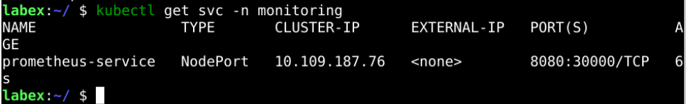
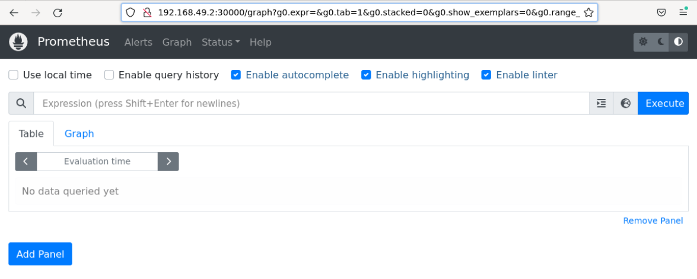
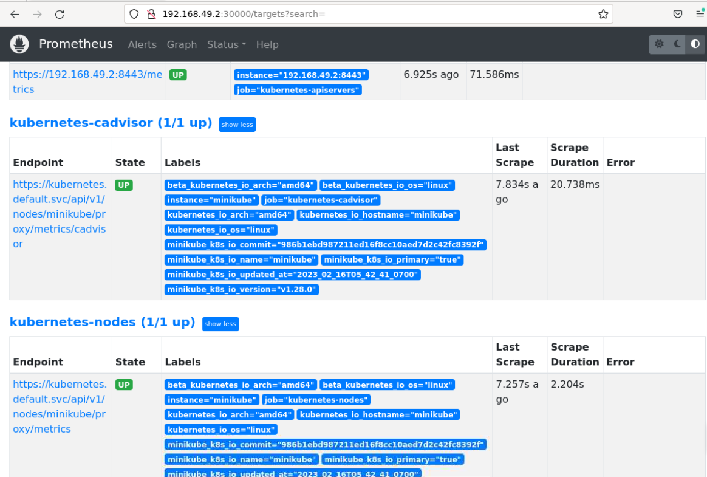
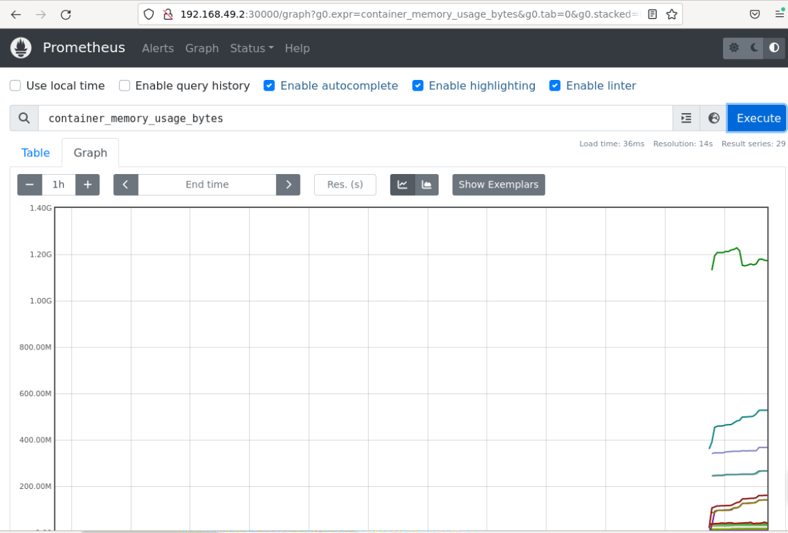

# Connecting To Prometheus Dashboard

## Introduction

Prometheus provides the Web UI, and now we need to access it.

## Target

Your goal is to expose the Prometheus deployed in `step 3` through a `NodePort` and then access Prometheus through a browser.

## Result Example

Here's an example of what you should be able to accomplish by the end of this challenge:

1. Create a file called `prometheus-service.yaml` and copy the following content to the [Prometheus Service YAML](https://raw.githubusercontent.com/joker-bai/kube-prometheus/main/service.yaml). We will be exposing Prometheus to all Kubernetes node IPs on port `30000`.

   

2. Access the Prometheus dashboard using any Kubernetes node’s IP on port 30000.
   

3. go to `Status --> Targets`, and you will see all the Kubernetes endpoints automatically connected to Prometheus using service discovery, as shown below.

   

4. Go to the home page, select the metrics you need from the drop and get the graph for the period you specify. An example graph for `container_memory_usage_bytes` is shown below.

   

## Requirements

To complete this challenge, you will need:

- A Kubernetes cluster has been installed and configured as required.
- The Prometheus has been installed
- Know how to expose ports within the cluster
