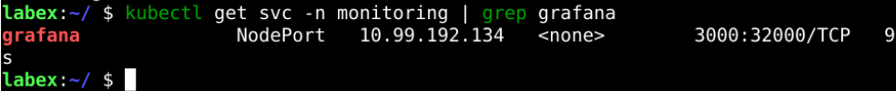

# Install Grafana

## Introduction

Grafana is a popular open-source data visualization and monitoring platform that allows you to display Prometheus monitoring data visually, logging information, application metrics, and more with Grafana. In Kubernetes, Grafana can be deployed using Helm Chart or YAML files.

An Install Grafana On Kubernetes challenge is provided here to help users better understand Grafana deployment and configuration and to give tips on how to use it.

## Target

Your goal is to deploy a Grafana Deployment and Service and expose the port through a NodePort.

## Result Example

Here's an example of what you should be able to accomplish by the end of this challenge:

1. Create a `prometheus-grafana.yaml` file and copy the following contents onto the [Grafana YAML File](https://raw.githubusercontent.com/joker-bai/kube-prometheus/main/grafana-deployment.yaml). Then, create a deployment on monitoring namespace using the above file.

   

2. Create a file named `grafana-service.yaml` and copy the following contents onto the [Grafana Service YAML](https://raw.githubusercontent.com/joker-bai/kube-prometheus/main/grafana-service.yaml). We will expose Grafana on all kubernetes node IP’s on port `32000`.

   

## Requirements

To complete this challenge, you will need:

- Kubernetes clusters have been installed and configured as required.
- Familiarity with Grafana deployment methods.
