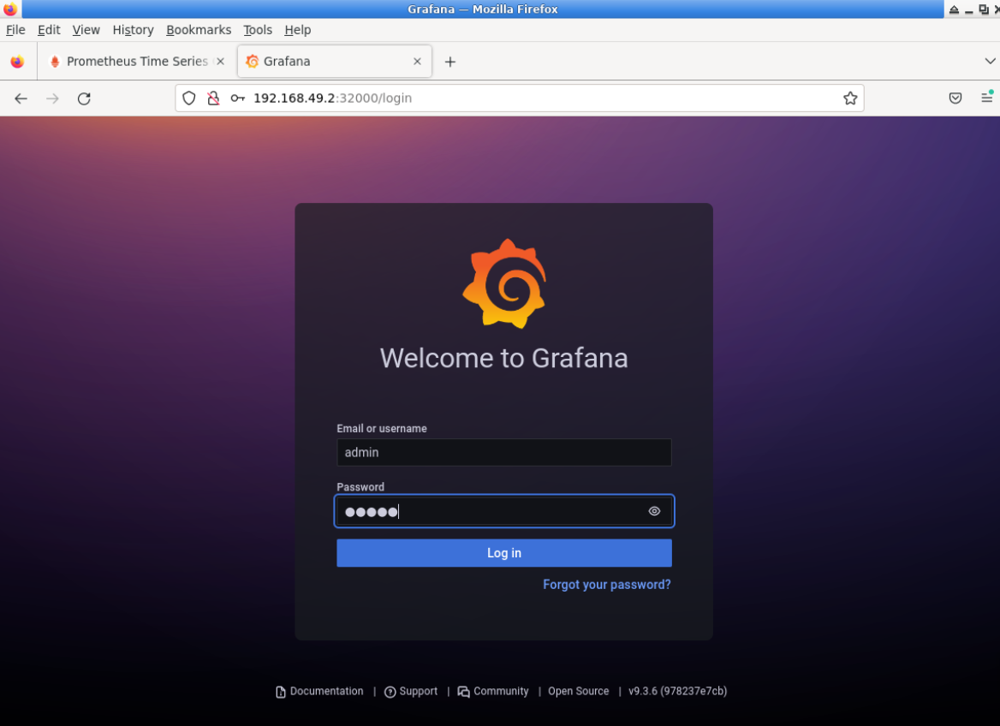
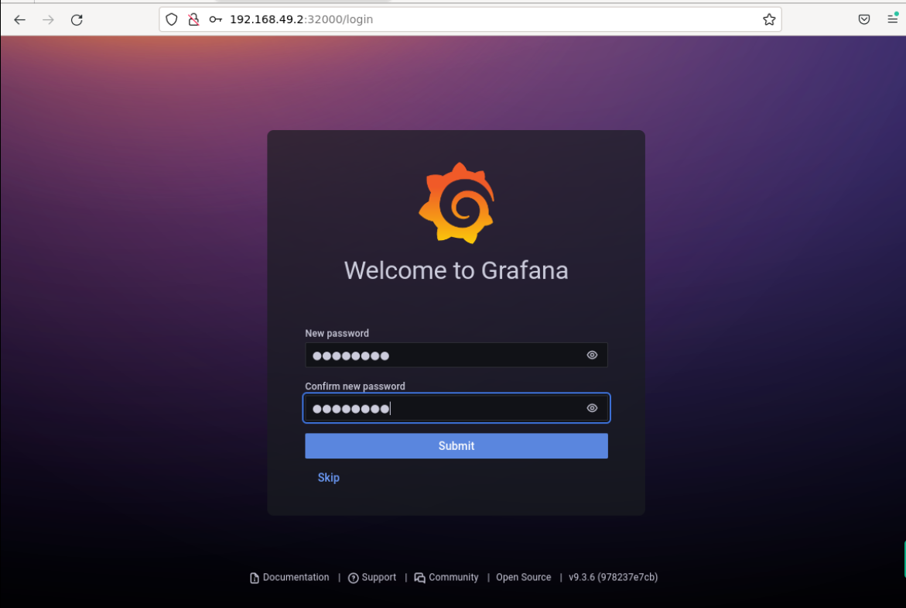
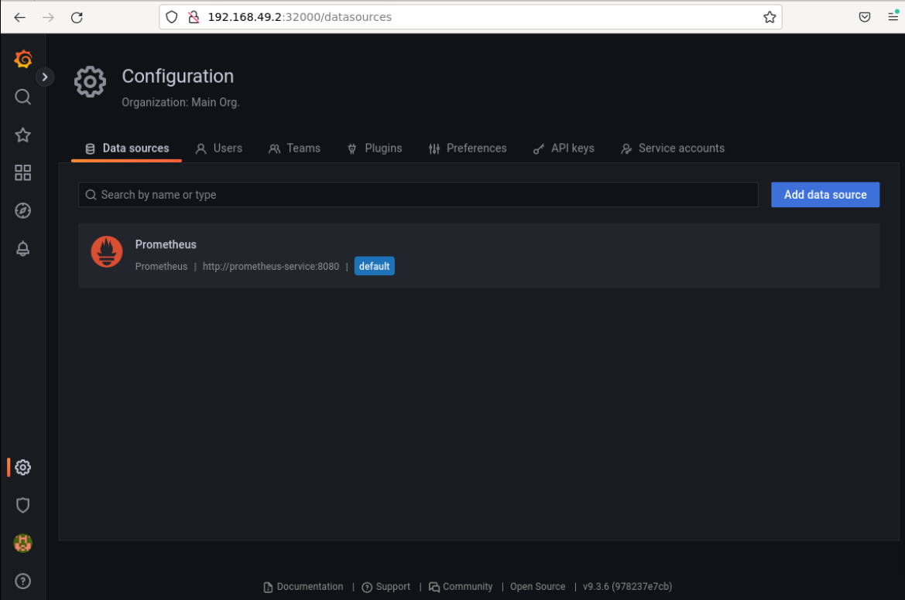
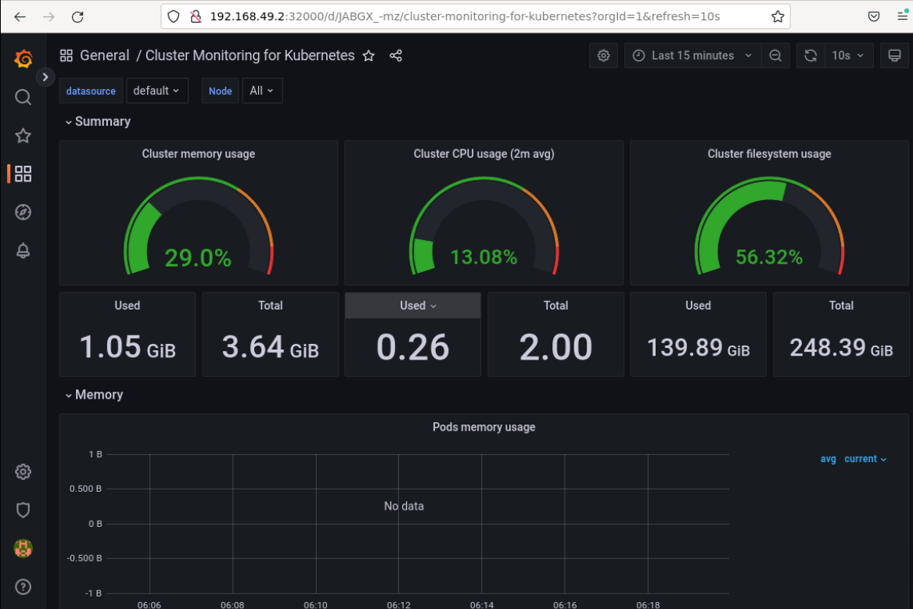

# Using Grafana

## Introduction

The default UI panel of Prometheus is relatively simple and cannot create a monitoring dashboard. In practice, the monitoring presentation is done by using the Grafana+Prometheus combination.

This challenge aims to help users deepen their understanding and skills in using Grafana.

## Target

Your goal is to connect to the Prometheus data source through Grafana and visualize Prometheus monitoring data on the Grafana Dashboard.

## Result Example

Here's an example of what you should be able to accomplish by the end of this challenge:

1. Access the Grfana UI using the IP of any Kubernetes node on port 32000.

   

2. Login to Grafana. The username and password are `admin` and `admin`.

3. Change your default password.

   

4. Select `Configuration -> Data Sources`. You can add the required data source. Select to add the Prometheus data source.

   

5. Select `Dashboards -> Import`. You can add the desired dashboard. We will now import the Grafana panel with ID `10000`.

   

## Requirements

To complete this challenge, you will need:

- A Kubernetes cluster has been installed and configured as required.
- You have installed and enabled Grafana
- You have prepared Prometheus monitoring data and stored it in Prometheus Server.
- You have prepared the Grafana Dashboard configuration file and imported it into Grafana.
