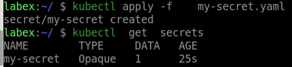

# Create A Secret

In this step, you will create a Kubernetes Secret that contains a database password.

Create a file named `my-secret.yaml` with the following contents:

```yaml
apiVersion: v1
kind: Secret
metadata:
  name: my-secret
type: Opaque
data:
  password: dXNlcm5hbWU6cGFzc3dvcmQ=
```

In this file, we specify the name of the Secret (`my-secret`), the type of data it contains (`Opaque`), and the actual data in Base64-encoded format.

Apply the Secret to your cluster by running the following command:

```bash
kubectl apply -f my-secret.yaml
```

Verify that the Secret was created by running the following command:

```bash
kubectl get secrets
```

You should see the `my-secret` Secret listed.

