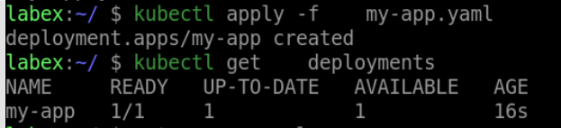

# Use The Secret In Your Application

In this step, you will modify your application to use the `my-secret` Secret to retrieve the database password.

Create a file named `my-app.yaml` with the following contents:

```yaml
apiVersion: apps/v1
kind: Deployment
metadata:
  name: my-app
spec:
  replicas: 1
  selector:
    matchLabels:
      app: my-app
  template:
    metadata:
      labels:
        app: my-app
    spec:
      containers:
        - name: my-app
          image: nginx:latest
          env:
            - name: DATABASE_PASSWORD
              valueFrom:
                secretKeyRef:
                  name: my-secret
                  key: password
```

In this file, we specify the name of the Deployment (`my-app`), the image to use (`my-image`), and the environment variable to set (`DATABASE_PASSWORD`). We also use a `secretKeyRef` to retrieve the `password` key from the `my-secret` Secret.

Apply the Deployment to your cluster by running the following command:

```bash
kubectl apply -f my-app.yaml
```

Verify that the Deployment was created by running the following command:

```bash
kubectl get deployments
```

You should see the `my-app` Deployment listed.

