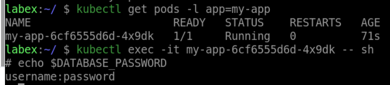

# Verify The Configuration

In this step, you will verify that your application is properly configured with the database password from the `my-secret` Secret.

Find the name of the pod running your application by running the following command:

```bash
kubectl get pods -l app=my-app
```

You should see a single pod running your application. Note the name of the pod.

Next, run the following command to open a shell session in the container running your application:

```bash
kubectl exec -it sh < pod-name > --
```

Replace `<pod-name>` with the name of the pod that you noted earlier.

Once you are in the shell session, run the following command to print the value of the `DATABASE_PASSWORD` environment variable:

```bash
echo $DATABASE_PASSWORD
```

You should see the database password that was retrieved from the `my-secret` Secret.

