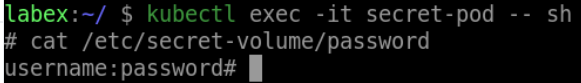

# Verify The Secret As A Volume In A Pod

In this step, you will verify that your application is properly configured with the database password from the `my-secret` Secret.

First, run the following command to open a shell session in the container running your application:

```bash
kubectl exec -it secret-pod -- sh
```

Once you are in the shell session, run the following command to print the value:

```bash
cat /etc/secret-volume/password
```

The output should be the value of the secret.

