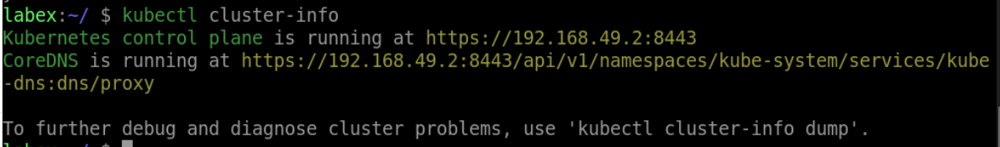

# Get The Kubernetes Cluster Information

To get the Kubernetes cluster information, use the following command:

```bash
kubectl cluster-info
```

This command displays the Kubernetes cluster's API server endpoint and the Kubernetes version.

