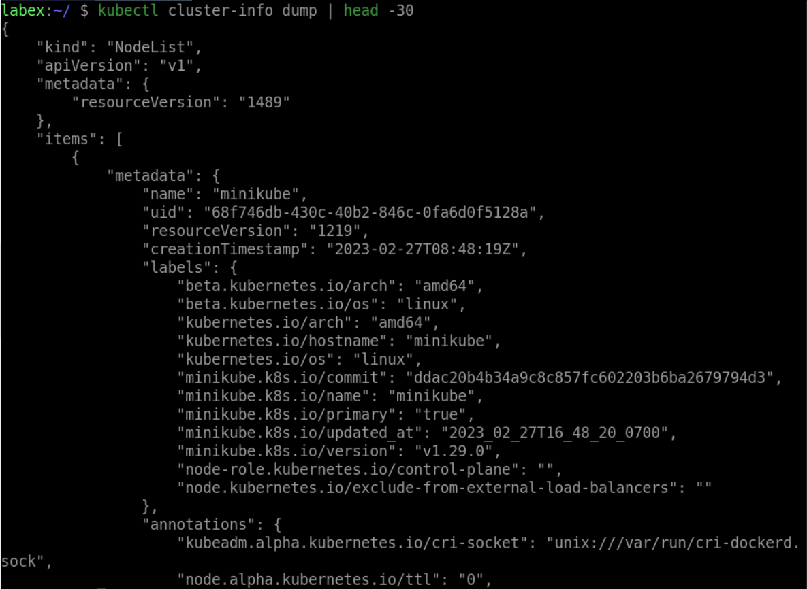

# Get The Kubernetes Components Information

To get the Kubernetes components' information, use the following command:

```bash
kubectl cluster-info dump
```

This command displays detailed information about the Kubernetes components, including etcd, kube-apiserver, kube-controller-manager, kube-scheduler, and other Kubernetes system components.

