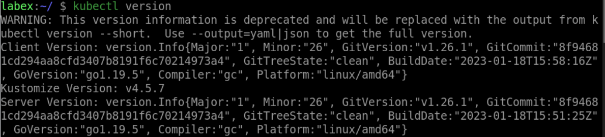

# Print the Server Version Information

To print the server version information, execute the following command:

```bash
kubectl version
```

This will output the server version information, including the Kubernetes version, Git commit hash, and build date, as well as the Kubernetes API serverversion, controller manager version, and scheduler version.


