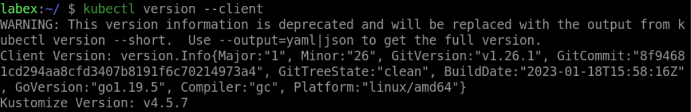

# Print the Client Version Information

To print the client version information, execute the following command:

```bash
kubectl version --client
```

This will output the client version information, including the Kubernetes version, Git commit hash, and build date.


