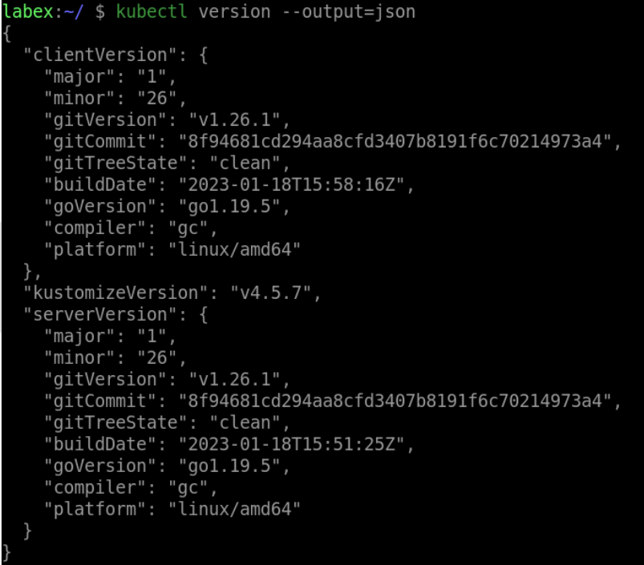

# Print the Server Version Information With JSON Output

To print the server version information with JSON output, execute the following command:

```bash
kubectl version --output=json
```

This will output the server version information in JSON format.


