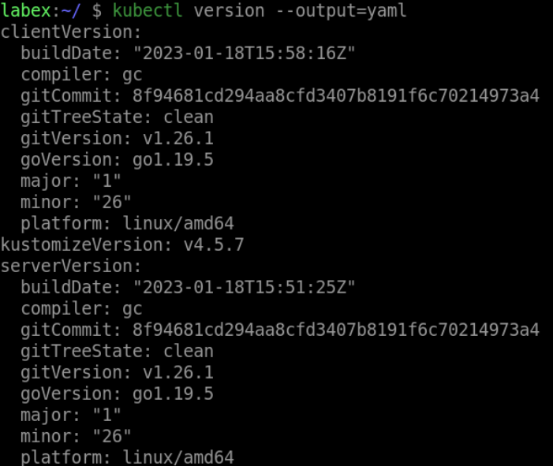

# Print the Server Version Information in YAML Format

To print the server version information in YAML format, execute the following command:

```bash
kubectl version --output=yaml
```

This will output the server version information in YAML format.


