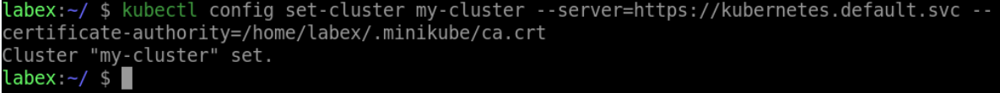

# Add a Cluster to the Kubeconfig File

To add a cluster to the kubeconfig file, use the `kubectl config set-cluster` command. This command requires the name of the cluster, the server URL, and the certificate authority (CA) data. Here's an example:

```shell
kubectl config set-cluster my-cluster \
  --server=https://kubernetes.default.svc \
  --certificate-authority=/home/labex/.minikube/ca.crt
```

This command adds a cluster named `my-cluster` to the kubeconfig file, with the specified server URL and CA data.


