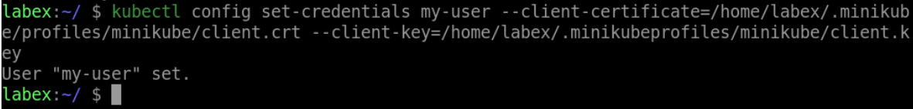

# Add a User to the Kubeconfig File

To add a user to the kubeconfig file, use the `kubectl config set-credentials` command. This command requires the name of the user, the user's client certificate, and the user's client key. Here's an example:

```shell
kubectl config set-credentials my-user \
  --client-certificate=/home/labex/.minikube/profiles/minikube/client.crt \
  --client-key=/home/labex/.minikube/profiles/minikube/client.key
```

This command adds a user named `my-user` to the kubeconfig file, with the specified client certificate and key.


