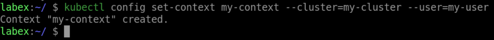

# Create a Context in the Kubeconfig File

To create a context in the kubeconfig file, use the `kubectl config set-context` command. This command requires the name of the context, the cluster to use, and the user to authenticate with. Here's an example:

```shell
kubectl config set-context my-context \
  --cluster=my-cluster \
  --user=my-user
```

This command creates a context named `my-context` in the kubeconfig file, using the `my-cluster` cluster and the `my-user` user.


