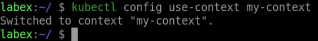

# Use a Context in the Kubeconfig File

To use a context in the kubeconfig file, use the `kubectl config use-context` command. This command requires the name of the context to use. Here's an example:

```shell
kubectl config use-context my-context
```

This command sets the current context to `my-context`, so all subsequent `kubectl` commands will use the specified cluster and user.


