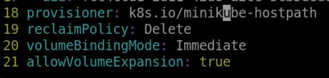

# Modify the PVC Storage Resources

In this step, you will modify the PVC to request specific storage resources from the PersistentVolume. You will modify the `pvc.yaml` file to request 1Gi of storage instead of 500Mi.

```yaml
apiVersion: v1
kind: PersistentVolumeClaim
metadata:
  name: my-pvc
spec:
  accessModes:
    - ReadWriteOnce
  resources:
    requests:
      storage: 1Gi
```

Add an `allowVolumeExpansion: true` field to storageclass in the last line.

```shell
kubectl edit storageclass standard
```



Apply the updated PersistentVolumeClaim to your cluster with the following command:

```shell
kubectl delete deployment web-app
kubectl delete pvc my-pvc
kubectl apply -f web-app.yaml
kubectl apply -f pvc.yaml
```
